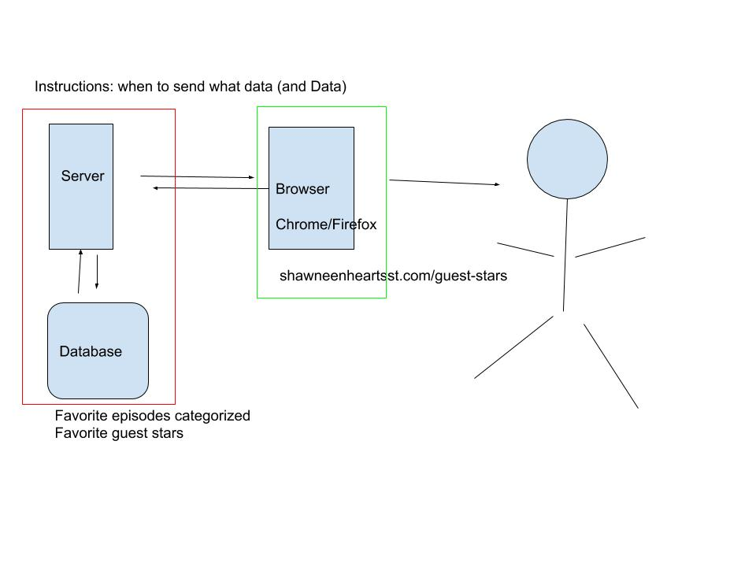

# 3/9/2019 Notes
*No recording of this, sorry!*

Notes from our first lesson. For you pedantic types -- keep in mind this was a conversation with total beginners.

## Things to Remember
- Try different tech concepts and have fun
- *Don't feel bad* about what you like
- *Don't feel bad* about your learning style, keep trying different things (docs, courses, books, etc.)

## Concepts/Vocab
- HTML: structure (HyperTextMarkupLanguage)
- CSS: design/color/animation (Cascading StyleSheets)
- JavaScript: functionality
- Ruby: a server/backend language that is super fun and beginner friendly
- Git: keeping track of shit in case you mess up (aka version control)
- Markdown: a shorthand language that gets converted to HTML
- Editor/IDE: where you write your code
- Server: the thing that hosts your site
- Browser: the thing that you look at your site with
- API: application programming interface, which is just a fancy way of saying a server that sends you data
- Node: a JavaScript server
- Frontend: the stuff users interact with, HTML + CSS + JS
- Framework: a collection of code to make life easier, like buying pie crust from the store. Examples: Angular, React, Vue. Usually written in JavaScript these days.
- Backend: working with servers, the data no one sees
- Database: where data lives

### Q from Shawneen: "What do frontend and backend refer to?"

### Backend language examples:
- Database: SQL
- C#
- Java
- Ruby
- JavaScript -- NodeJS/Express

### Frontend language examples:
- HTML
- CSS
- JavaScript
- Frameworks
  - Angular -- created by Google (uses a lot of Microsoft tech too)
  - React -- created by Facebook
  - Vue -- independent
  - Literally a zillion more

### Q from Shaneen: "What is 'Full-stack'"?

- Stack: the technology used at each level

1. Database: SQL Server (Microsoft), MongoDB, etc
2. Server/Back end: Node (JavaScript), Spring (Java), .NET (C#)
3. Browser/Front end: Angular, React, Vue, JQuery (JavaScript) -- + HTML + CSS

Some example stacks:

Microsoft Stack:
- SQL Server - db
- .NET - C# library for the server
- jQuery/Angular - JS frameworks

MEAN stack:
- MongoDB - db
- Express - server (built on Node/JavaScript)
- Angular - front end

JAM stack (I'll explain this next time):
- JavaScript - front end/back end rendering
- APIs - various sources of data
- Markdown - static content

## Tools
- [GitHub](https://github.com/)
- [Git for Windows](https://gitforwindows.org/)
- [Oh Shit Git](http://ohshitgit.com/)
- [Visual Studio Code](https://code.visualstudio.com/)
- [StackBlitz](https://stackblitz.com/)
- [Code Sandbox](https://codesandbox.io/)
- [Markdown](https://github.com/adam-p/markdown-here/wiki/Markdown-Cheatsheet)

## Articles & Courses to Get Started
- [Beginning Your Web Dev Journey](https://hackernoon.com/beginning-your-web-development-journey-start-here-7084346f5762)
- [Learning to Learn](https://css-tricks.com/learning-to-learn/) by Sarah Drasner
- [Free Code Camp](https://www.freecodecamp.org/) (start here)
- [Web Developer Bootcamp](https://www.udemy.com/the-web-developer-bootcamp/) (and here)
- [Marksheet](https://marksheet.io/) (and here)
 
## More Resources for Your Back Pocket
- [Reddit: r/learnprogramming Wiki](https://www.reddit.com/r/learnprogramming/wiki/faq)
- [Mozilla Developer Network: Learn Web Development](https://developer.mozilla.org/en-US/docs/Learn)
- [Courses by Maximilian Schwarzmuller](https://www.udemy.com/courses/search/?q=Maximilian%20Schwarzm%C3%BCller&src=sac&kw=maxim) (possibly more advanced)
- [Frontend Masters: Intro to Web Dev v2](https://frontendmasters.com/courses/web-development-v2/)
- [Pluralsight: HTML5 path](https://app.pluralsight.com/paths/skill/html5)

## Homework
1. Sign up for GitHub
2. Install Git (Windows [here](https://gitforwindows.org/))
3. Install [Visual Studio Code](https://code.visualstudio.com/)
4. Sign up for [Free Code Camp](https://www.freecodecamp.org/)
5. Start going through a few lessons
